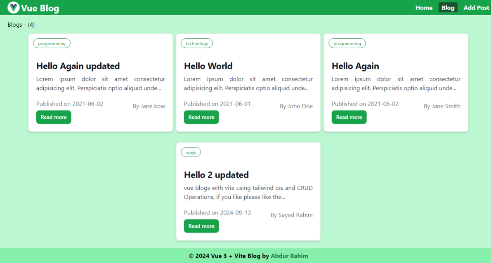
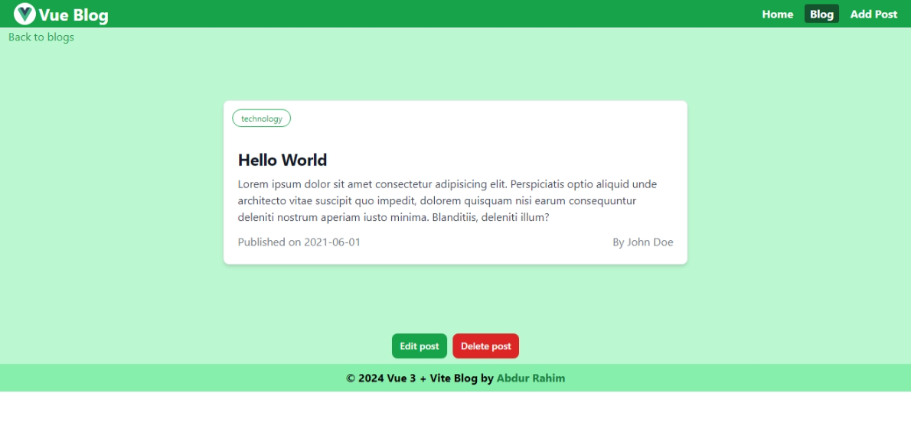
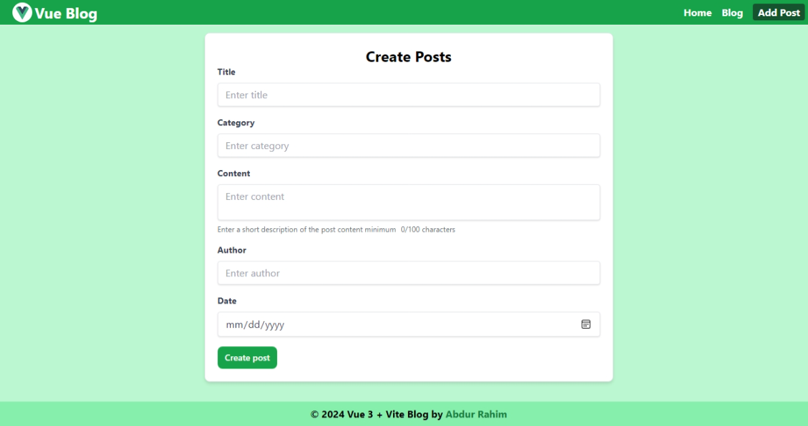
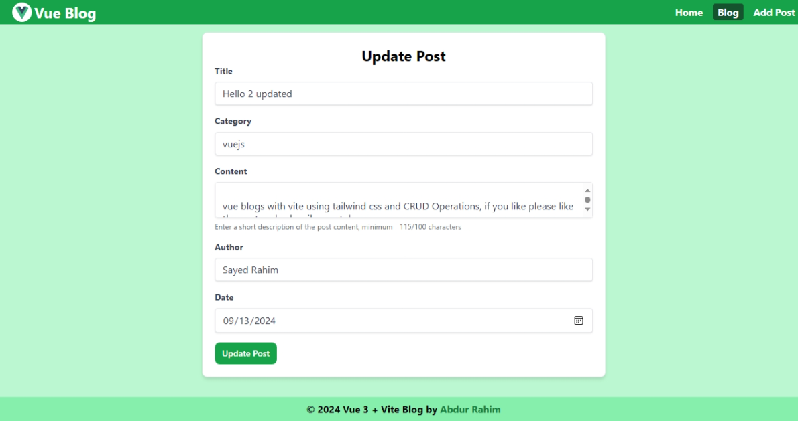

#  Vite +  Vue 3 Blogs  

A simple blog web built with Vite and Vue 3 Composition API using Tailwind CSS. 

## Features
- Vue 3 Composition API
- Post Create 
- Post Read
- Post Update
- Post Delete

## Installation in local
```bash
git clone https://github.com/AbdurRaahimm/vue-blogs.git
```
```bash
cd vue-blogs
```
```bash
npm install
```
```bash
npm run dev
```
## Json Server run
```bash
npm run server
```


## Screenshots







## Demo
[Live Demo](https://vue-blogs.netlify.app/)


## Built With
- [Vite](https://vitejs.dev/)
- [Vue 3](https://v3.vuejs.org/)
- [Tailwind CSS](https://tailwindcss.com/)
- [Json Server]( https://www.npmjs.com/package/json-server)
- [ref - Vue 3 Composition API](https://v3.vuejs.org/guide/composition-api-introduction.html)
- [reactive - Vue 3 Composition API](https://v3.vuejs.org/guide/reactivity-computed-watchers.html#reactivity)
- [provide/inject - Vue 3 Composition API](https://v3.vuejs.org/guide/composition-api-provide-inject.html#provide-inject)
- [vue-router - Vue 3](https://next.router.vuejs.org/)
- [fetch api](https://developer.mozilla.org/en-US/docs/Web/API/Fetch_API)


## Connect on Social Media
- [Twitter](https://twitter.com/AbdurRahim4G)
- [Instagram](https://www.instagram.com/abdurrahim4g/)
- [Facebook](https://www.facebook.com/Rahim72446)
- [LinkedIn](https://www.linkedin.com/in/abdur-rahim4g/)
- [YouTube](https://youtube.com/@AbdurRahimm)
